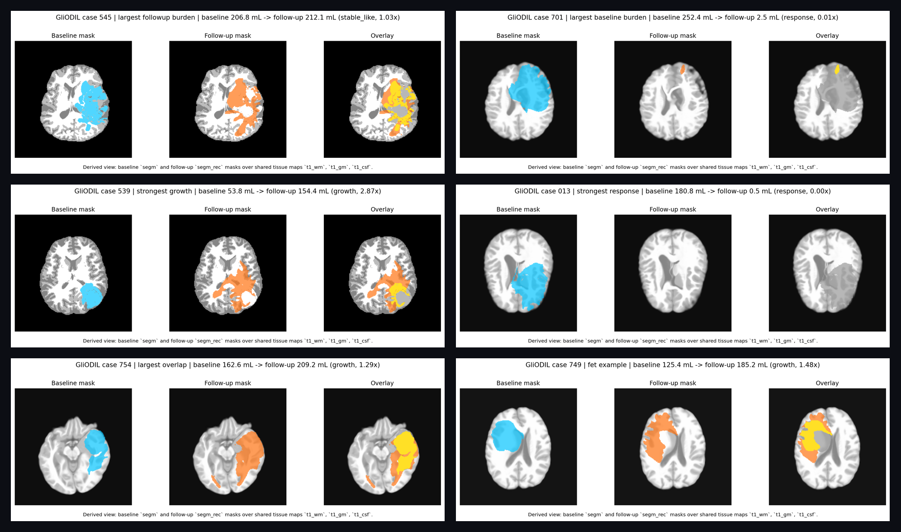

# GliODIL Longitudinal Manifest

- Source dataset: `m1balcerak/GliODIL`
- Cases scanned: 152
- Cases with FET-PET: 58
- Dataset README states the cohort covers two timepoints: pre-surgery and post-treatment follow-up.
- This manifest maps `segm.nii.gz` to the baseline lesion mask and `segm_rec.nii.gz` to the follow-up/recurrence mask based on the file naming in the essential release.
- The exported PNGs are derived visualizations, not raw MRI slices. They use the shared `t1_wm`, `t1_gm`, and `t1_csf` tissue maps as a grayscale anatomical background.

## Summary

- Median baseline burden: 90.86 mL
- Median follow-up burden: 43.68 mL
- Largest baseline burden: case 701
- Largest follow-up burden: case 545

## Showcase Picks

| Slot | Case | Reason | FET | Baseline (mL) | Follow-up (mL) | Ratio | Preview |
| --- | --- | --- | --- | --- | --- | --- | --- |
| `largest_followup_burden` | `545` | Largest follow-up tumor burden | no | 206.80 | 212.12 | 1.03x | [view](showcase/largest_followup_burden_545.png) |
| `largest_baseline_burden` | `701` | Largest baseline tumor burden | yes | 252.41 | 2.47 | 0.01x | [view](showcase/largest_baseline_burden_701.png) |
| `strongest_growth` | `539` | Largest increase from baseline to follow-up | no | 53.75 | 154.37 | 2.87x | [view](showcase/strongest_growth_539.png) |
| `strongest_response` | `013` | Largest decrease from baseline to follow-up | yes | 180.82 | 0.50 | 0.00x | [view](showcase/strongest_response_013.png) |
| `largest_overlap` | `754` | Largest shared tumor footprint across both timepoints | yes | 162.57 | 209.23 | 1.29x | [view](showcase/largest_overlap_754.png) |
| `fet_example` | `749` | High-burden case with FET-PET available | yes | 125.36 | 185.17 | 1.48x | [view](showcase/fet_example_749.png) |

## Top Follow-up Cases

| Case | FET | Baseline (mL) | Follow-up (mL) | Delta (mL) | Ratio | Trend |
| --- | --- | --- | --- | --- | --- | --- |
| `545` | no | 206.80 | 212.12 | 5.32 | 1.03x | `stable_like` |
| `754` | yes | 162.57 | 209.23 | 46.66 | 1.29x | `growth` |
| `749` | yes | 125.36 | 185.17 | 59.81 | 1.48x | `growth` |
| `744` | yes | 161.76 | 157.85 | -3.91 | 0.98x | `stable_like` |
| `539` | no | 53.75 | 154.37 | 100.62 | 2.87x | `growth` |
| `705` | yes | 186.25 | 149.72 | -36.53 | 0.80x | `stable_like` |
| `742` | yes | 120.50 | 139.28 | 18.78 | 1.16x | `stable_like` |
| `461` | no | 41.86 | 137.54 | 95.68 | 3.29x | `growth` |
| `419` | no | 174.76 | 133.58 | -41.19 | 0.76x | `response` |
| `729` | yes | 37.17 | 130.23 | 93.06 | 3.50x | `growth` |
